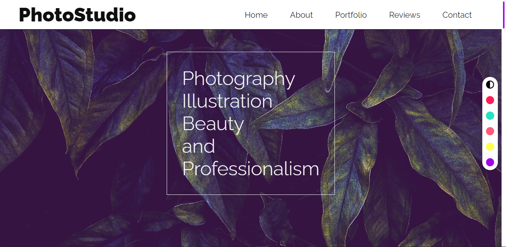
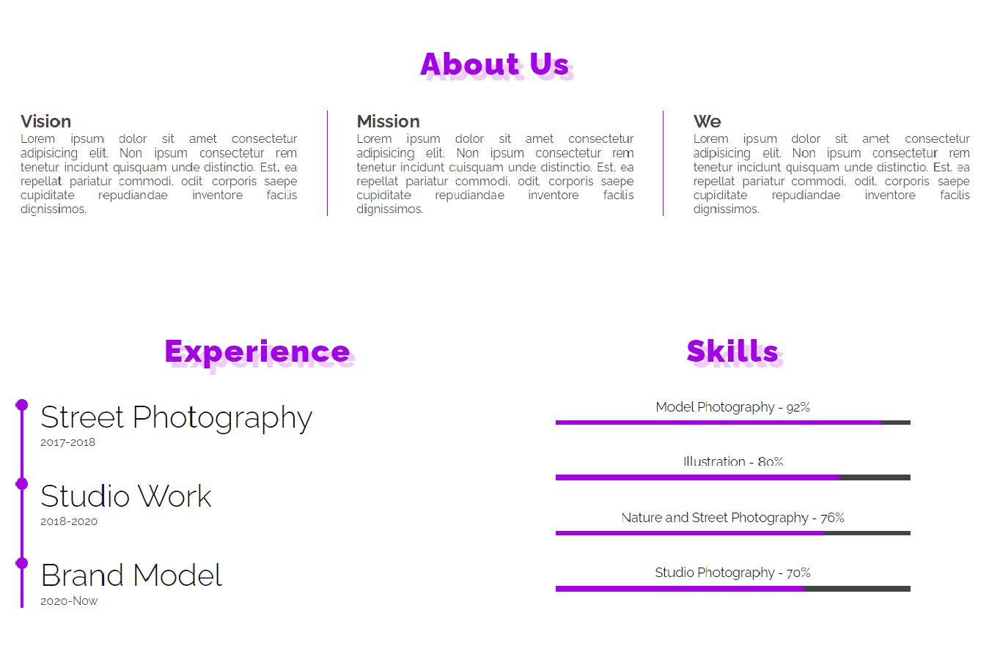
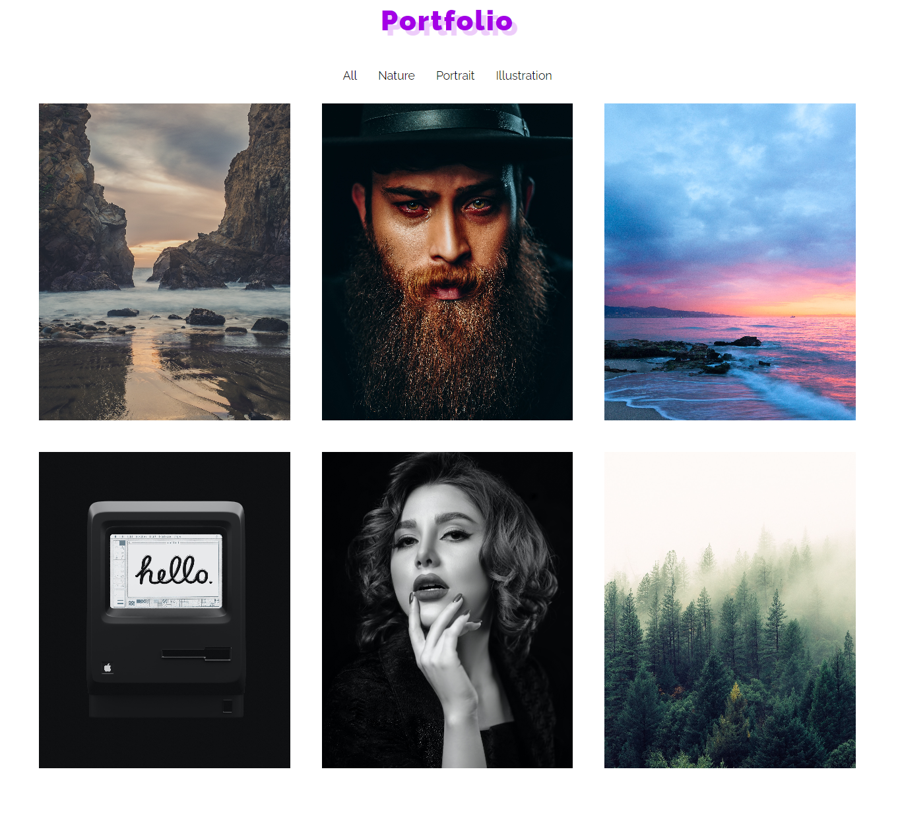
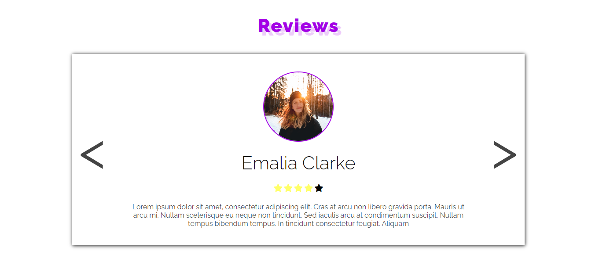
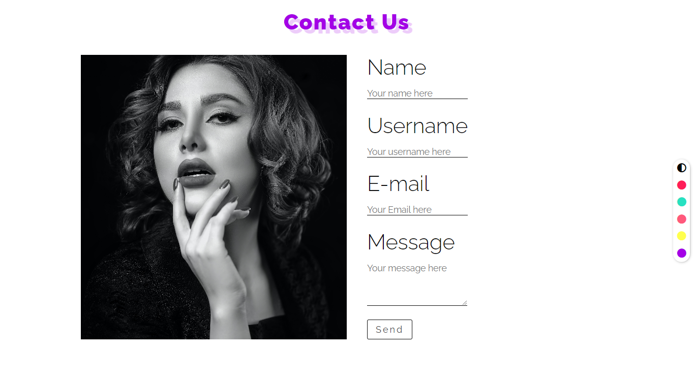

# Responsive Portfolio PhotoStudio Website Theme
## # Header
<ul>
    <li>A lot of information, Stylish navigation, Exuberance of colors. 
        A simple yet full design that you can create different themes with just a few clicks.</li>
</ul>

    

  

## # About
<ul>
    <li>Dark and Light Mode</li>
    <li>7 Color Themes</li>
    <li>Responsive Design</li>
    <li>Understandable and Clean Code</li>
</ul>

    

  

## # Portfolio
<ul>
    <li>Filterable Menu</li>
    <li>Different Color Hover Label</li>
    <li>Grid Responsive box</li>
</ul>

    

  

## # Review
<ul>
    <li>Slider Reviews</li>
    <li>Easy Replacement</li>
</ul>

    

  

## # Contact

    

# Thanks

Thank you Unsplash for the excellent pictures.

Thank you Fontawesome for excellent fonts.

